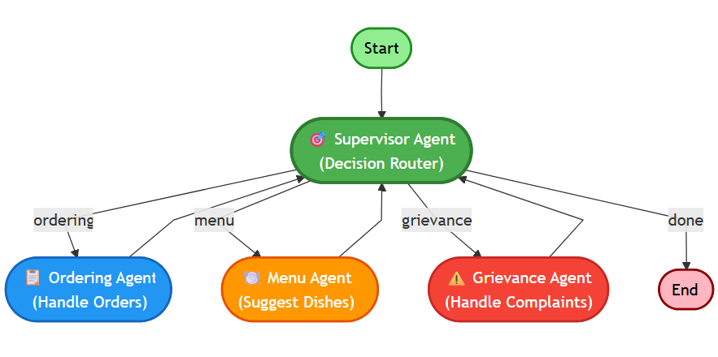

# SatMultiAgents

A sample multi-agent orchestration application built with FastAPI, LangGraph, and LangChain.

## Overview



This project demonstrates a supervisor-worker architecture where a `supervisor` agent routes incoming user queries to specialized worker agents:

- `ordering` agent: handles food orders
- `menu` agent: suggests dishes and desserts
- `grievance` agent: handles complaints

The application uses OpenAI models through `langchain_openai` and builds orchestration using `langgraph`.

## Project Structure

- `main.py` - FastAPI application exposing endpoints for chat requests and workflow diagram generation.
- `agents.py` - defines the agent graph, worker functions, supervisor routing logic, and compiled orchestration graph.
- `dashboard.html` - static dashboard UI layout for the multi-agent orchestration app.
- `requirements.py` - dependency list for the project.
- `execution_traces/` - saved execution trace JSON files.
- `workflow_diagrams/` - generated Mermaid workflow diagram source files.

## Prerequisites

- Python 3.11+ recommended
- `OPENAI_API_KEY` set in the environment or a `.env` file

## Dependencies

Install the required Python packages:

```powershell
python -m pip install fastapi uvicorn langgraph langchain-openai python-dotenv pillow graphviz
```

If you prefer, create your own `requirements.txt` from the dependency list in `requirements.py`.

## Setup

1. Create and activate a virtual environment:

```powershell
python -m venv venv
.\venv\Scripts\Activate.ps1
```

2. Install dependencies:

```powershell
python -m pip install fastapi uvicorn langgraph langchain-openai python-dotenv pillow graphviz
```

3. Create a `.env` file in the project root containing:

```text
OPENAI_API_KEY=your_openai_api_key_here
```

## Running the Application

Start the FastAPI app with Uvicorn:

```powershell
uvicorn main:app --reload
```

By default the app runs on `http://127.0.0.1:8000`.

## Usage

### Chat endpoint

Send a POST request to `/chat` with JSON payload:

```json
{
  "query": "I want to order a pizza"
}
```

The app returns a generated response from the multi-agent workflow.

### Workflow image endpoint

Send a POST request to `/download_workflow_image` to generate and download the current workflow diagram as an SVG file.

## Notes

- Execution traces are recorded under `execution_traces/` as JSON files.
- Mermaid workflow source is saved under `workflow_diagrams/`.
- The supervisor agent decides which worker agent to call next and may reroute back to the supervisor until the decision is `done`.
- The project is designed as a learning sample for agent orchestration and workflow visualization.

## License

This project is provided as-is for demonstration and learning purposes.
